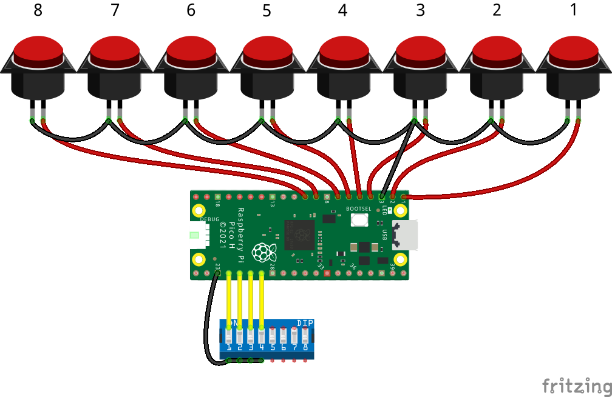

# The ezResponseBox
*Open source response box for 1-8 buttons based on the Raspberry Pico*

Button reponse boxes are commonly used in Psychology experiments. Usually, response boxes are interfaced as serial device or as Human Interface Device (HID) like a keyboard or joystick.

The Raspberry Pico is a low cost micro-controller platform. Together with the desirable number of input buttons (1-8) and a plastic box enclosure, a less than 50$ response box can be realized with similar specifications as to most of the commercial counterparts. The *ezResponseBox* can be used for example with [OpenSesame](https://osdoc.cogsci.nl/), PsychoPy or E-Prime.

The Easy Response Box or *ezResponseBox* can operate both, as a keyboard or a joystick type of response box with a typical latency of 1ms (=1000Hz update rate). The latency is 10 to 20 times lower than for a standard PC-keyboard.

In keyboard mode I, the *ezResponseBox* sends a keystroke of key numbers 1 to 8, depending on the pressed button(s). Simultaneous key presses are sent with the same USB packet (this will happen very seldom because of the high input scan rate).

In keyboard mode II, the *ezResponseBox* sends out two hexadecimal digits, ranging from `00` tot `FF`. Simultaneous key presses should be decoded in the application program.

The advantage of a joystick HID device is, that every state change of the input is sent to the host as eight bit joystick button state. The decoding of the buttons should be done in the application program.

The *ezResponseBox* scans eight digital inputs for reading the momentary button knobs status. Both, Normally Open (NO) and Normally Closed (NC) contacts can be used. The connected button contact type is scanned at power up. NC contacts are faster for detecting the onset of a response. The eight input channels are scanned at a rate of 10kHz and the readings are debounced with a FIR digital filter algorithm with a delay of two sample periods. The debounced information is then transmitted on the next available USB packet. Only input state changes are sent to the computer.

## Specifications
- USB 2.0
- works under Windows or Linux
- no drivers needed 
- works as a keyboard or joystick HID-composite device
- 1ms latency (minimum for HID)
- 10kHz input port scan rate
- integrated debouncing filter

GPIO pin vs. keyboard/joystick button number:

GPIO-pin | GP0 | GP1 | GP2 | GP3 | GP4 | GP5 | GP6 | GP7
-------- | --- | --- | --- | --- | --- | --- | --- | ---
key press | "1" | "2" | "3" | "4" | "5" | "6" | "7" | "8"
joystick button | 0 | 1 | 2 | 3 | 4 | 5 | 6 | 7 

## The Input GPIOs
The input GPIOs are GP0 - GP7. The pull-up function is active on all the inputs to interface directly to push buttons.

**Using NO/NC button contacts**
In the default situation, the *ezResponseBox* works with NO-contacts. If at least one connected switch is NC, the *ezResponseBox* will detect this at start up (immediately after connecting the USB port) and all of the logic input readings will be inverted. Please, don't mix up NO and NC contacts for the sake of simplicity. When using NC-contacts, please tie the unused input pins to the ground (GND).

## The Output GPIOs
The output GPIOs are GP8 - GP15. The logic level is 3.3V. Level converters and/or line drivers are needed to interface to external 5V TTL logic or LEDs.

## Configuration settings
When plugged into the  USB port of the computer, multiple devices will register to the operating system. The only active device is selected through jumper wires or DIP-switches. The configuration is set at start up. See the table below for the configuration settings.

GPIO-pin  | open input | input tied to GND with jumper wire or DIP-switch
--------- | ---------- | ------------------------------------------------
GPIO18 | select keyboard | select joystick
GPIO19 | select numerical keys (mode I) | select hexadecimal digits (mode II)
GPIO20 | debouncing ON | debouncing OFF
GPIO21 | positive logic outputs | negative logic outputs

## Preparing your Raspberry Pico
Connect the pico to the PC while pressing the BOOTSEL button. A mass storage device will pop up. Drag the uf2 firmware file into the drive and ready you are!

## Known bugs
Outputs (or displays) only one zero hex character in keyboard mode II for the 0-state input code on Linux Ubuntu (22.04)

